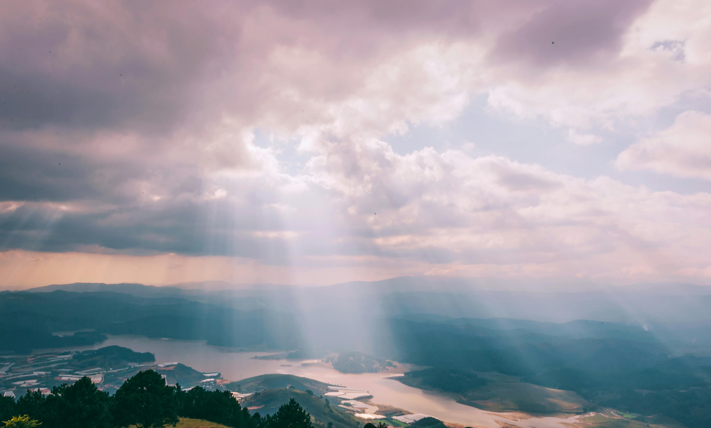

# zgui6644_Major Project_Time-Based Animation

## Animation Instructions
1. **Load the page**
Open the 'index.html' file in your web browser.
2. **Animation**
When the page loads, the animation will start automatically. Watch it, and enjoy it.

## Individual Approach to Animating the Group Code
### Animation Driver
I chose **time** to drive my individual code. The animations are based on the **'millis()'** function, creating smooth oscillations and transitions on the sky, river, reflection and the right building to make the artwork look alive with water flow and sunshine.

### Animated Properties
- **Sky:** Diagonal lines with oscillating angles.
- **River and Reflection:** Wave-like height changes with a reduced range.
- **Building 2 (the right one):** Swaying positions for dynamic effect.

### Uniqueness
- **Zhuoya’s** code uniqueness is mainly changes in properties angles and positions, including the angle of key diagonal lines, the height oscillation of river and reflection, and the horizontal swaying of the right building.
- **Nicholas** focuses on colour switches via interactions.
- **Boris** animates movements of lines that fill the river and buildings using Perlin noise to create an illusion of moving waves and shimmering reflections of buildings.

## References and Inspiration

*@Min An*

*@Bella White*

### Inspirations
- The light in both images is visualised, cause they are the light in the Tyndall effect looks like lines. This is the inspiration for the **sky** in my code. When the different segments in the sky swing, the lines inside sometimes intersect and sometimes connect, highlighting the edge of the segments and making them run through the sky like light. 
- When the water flows, the reflection of the light on the water surface will also swing. This is my inspiration for the **river and reflection**.
- As for the distant **building** in my code, it looms like the distant mountain in the image. Therefore, I applied a slight shaking animation to the distant building on the right.

## Technical Explanation
### Changes to Group Code
- Added **'startTime'** variable for time-based animations.
- Instead **'drawSky'** with the **'animateShapes'** function for animations of sky segments.
- Modified **'drawRiver'** and **'drawBuilding2'** functions to include wave and sway effects.

### External Technical Explanation
The **'millis()'** function is used to create time-based animations. It refers to **returning the number of milliseconds since a sketch started running, and keeping track of how long a sketch has been running in milliseconds** (thousandths of a second) (Reference), which is helpful for timing events and animations. Therefore, it is suitable to apply it to the sky, river, reflection and buildings in my code, using sine waves to create smooth oscillations.

## Reference
1. An, M. (2018, September 9). *Mountain and sunshine.* Pexels. [Link.](https://www.pexels.com/zh-cn/photo/1403550/.)
2. McCarthy, L. L. (2024). *millis().* reference | p5.js. [Link.](https://p5js.org/reference/#/p5/millis.)
3. White, B. (2014, May 11). *Ocean and sunshine.* Pexels. [Link.](https://www.pexels.com/zh-cn/photo/635279/.)